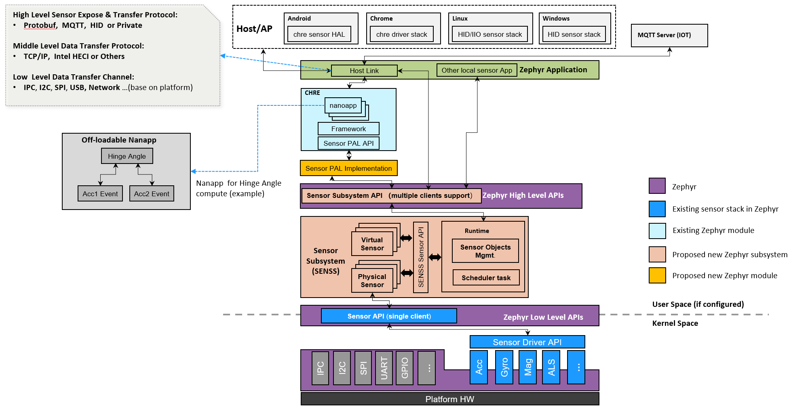
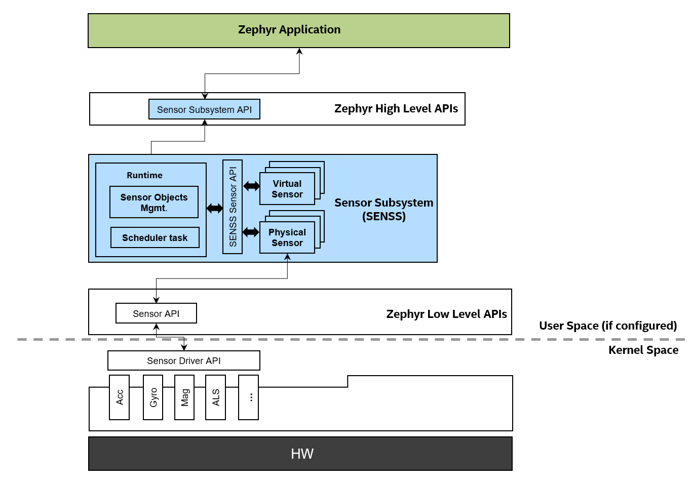

.. _senss_api:

Sensor Subsystem (SENSS)
########################

.. contents::
    :local:
    :depth: 2

Overview
********

Senss is a high level sensor framework inside the OS user
space service layer. It is a framework focused on sensor fusion, client
arbitration, sampling, timing, scheduling and sensor based power management.

Key concepts in Senss include physical sensor and virtual sensor objects,
and a scheduling framework over sensor object relationships.
Physical sensors do not depend on any other sensor objects for input, and
will directly interact with existing zephyr sensor device drivers.
Virtual sensors rely on other sensor objects (physical or virtual) as
report inputs.

The sensor subsystem relies on existing zephyr sensor device APIs or V2
zephyr sensor device APIs (`PR#44098 <https://github.com/zephyrproject-rtos/zephyr/pull/44098>`_).

So it can leverage current existing zephyr sensor device drivers (100+).
And it's configurable, so, for some low cost IoT devices, may not need an
advanced sensor framework, but just need access some simple sensor
devices,can not configure and build this sensor subsystem, but just use
the exiting zephyr sensor device APIs to save memory resources.

Since the sensor subsystem is separated from device driver layer or
kernel space and could support various customizations and sensor
algorithms in user space with virtual sensor concepts. The existing
sensor device driver can focus on low layer device side works, can keep
simple as much as possible, just provide device HW abstraction and
operations etc. This is very good for system stability.

The sensor subsystem is decoupled with any sensor expose/transfer
protocols, the target is to support various up-layer frameworks and
Applications with different sensor expose/transfer protocols,
such as `CHRE <https://github.com/zephyrproject-rtos/chre>`_, HID sensors Applications, MQTT sensor Applications
according different products requirements. Or even support multiple
Applications with different up-layer sensor protocols at the same time
with it's multiple clients support design. For example can support CHRE
and other normal zephyr sensor application (can use HID etc) at
the same time.

Sensor subsystem can help build a unified Zephyr sensing architecture for
cross host OSes support and as well of IoT sensor solutions.

Below is the proposed solution with sensor subsystem:

Configurability
===============

* Reusable and configurable standalone subsystem.
* Based on Zephyr existing low-level Sensor API (reuse 100+ existing sensor device drivers)
* Provide Zephyr high-level Sensor Subsystem API for Applications.
* Separate option CHRE Sensor PAL Implementation module to support CHRE.
* Decoupled with any host link protocols, it's Zephyr Application's role to handle different
  protocols (MQTT, HID or Private, all configurable)

Configure Options
=================
* A: CHRE (optional, need config for Chrome host)
* B: CHRE Sensor PAL Implementation (optional, must if A configured)
* C: Sensor Subsystem (optional, must if B or D configured)
* D: HID (optional, need config for Windows/Linux host)

For simple low-cost sensor devices, can use existing Zephyr sensor driver API directly,  no
need configure A, B, C or D.

Main Features
=============

* Scope
    * Focus on framework for sensor fusion, multiple clients, arbitration, data sampling, timing
      management and scheduling.

* Sensor Abstraction
    * ``Physical sensor``: interact with Zephyr sensor device drivers, focus on data collecting.
    * ``Virtual sensor``: relies on other sensor(s), ``physical`` or ``virtual``, focus on data fusion.

* Data Driven Model
    * ``Polling mode``:  periodical sampling rate
    * ``Interrupt mode``:  data ready, threshold interrupt etc.

* Scheduling
    * single thread main loop for all sensor objects sampling and process.

* Buffer Mode for Batching
* Configurable Via Device Tree

API Design
**********

API Organization
================

* Sensor Subsystem
    * Sensor Types (:zephyr_file:`include/zephyr/senss/senss_sensor_types.h`)
    * Data Types (:zephyr_file:`include/zephyr/senss/senss_datatypes.h`)
    * Sensor Subsystem API (:zephyr_file:`include/zephyr/senss/senss.h`)
    * Sensor API (:zephyr_file:`include/zephyr/senss/senss_sensor.h`)

Below diagram shows the API position and scope:

``Sensor Subsystem API`` is for Applications. ``Sensor API`` is for development ``sensors``.

Sensor Types And Instance
=========================

Sensor subsystem use ``sensor type`` and ``sensor index`` (support multiple instance of same type) to unique identify a sensor instance.

``Sensor index`` 0 always indicate the default sensor instance of a ``sensor type``.

``Sensor type`` follows the `HID standard sensor types definition <https://usb.org/sites/default/files/hutrr39b_0.pdf>`_.

.. code-block:: c

    /**
     * sensor category light
     */
    #define SENSS_SENSOR_TYPE_LIGHT_AMBIENTLIGHT            0x41
    #define SENSS_SENSOR_TYPE_LIGHT_CONSUMER_INFRARED       0x42

    /**
     * sensor category motion
     */
    #define SENSS_SENSOR_TYPE_MOTION_ACCELEROMETER_1D       0x71
    #define SENSS_SENSOR_TYPE_MOTION_ACCELEROMETER_2D       0x72
    #define SENSS_SENSOR_TYPE_MOTION_ACCELEROMETER_3D       0x73
    #define SENSS_SENSOR_TYPE_MOTION_GYROMETER_1D           0x74
    #define SENSS_SENSOR_TYPE_MOTION_GYROMETER_2D           0x75
    #define SENSS_SENSOR_TYPE_MOTION_GYROMETER_3D           0x76
    #define SENSS_SENSOR_TYPE_MOTION_MOTION_DETECTOR        0x77
    #define SENSS_SENSOR_TYPE_MOTION_ACCELEROMETER          0x79
    #define SENSS_SENSOR_TYPE_MOTION_GYROMETER              0x7A

    /**
     * sensor category other
     */
    #define SENSS_SENSOR_TYPE_OTHER_CUSTOM                  0xE1

    #define SENSS_SENSOR_TYPE_ALL                           0xFFFF

Sensor Instance Handler
=========================

Clients using a ``int`` type handler to handle a opened sensor
instance, and all subsequent operations on this sensor instance need use this handler, such as set configurations,
read sensor sample data, etc.

For a sensor instance, could have two kinds of clients: ``Application clients`` and ``Sensor clients``.

``Application clients`` can use :c:func:`senss_open_sensor` to open a sensor instance and get it's handler.

For ``Sensor clients``, there is no open API for opening a reporter, because the client-report relationship is built at the sensor's registration stage with devicetree.  ``Sensor clients`` can get it's reporters' handlers via :c:func:`senss_sensor_get_reporters`.

Sensor Sample Value
==================================

* Data Structure

  Each sensor sample value data structure defined as a common ``header`` + ``readings[]`` structure.

  .. code-block:: c

      struct senss_sensor_value_xxx {
         struct senss_sensor_value_header header;
         struct data {
            uint32_t timestamp_delta;
            union {
                          ...
            };
         } readings[1];
      };

  The ``header`` definition:

  .. code-block:: c

      struct senss_sensor_value_header {
         /** base timestamp of this data readings, unit is micro seconds */
         uint64_t base_timestamp;
         /** count of this data readings */
         uint16_t reading_count;
      };

* Time Stamp

  Time stamp unit in sensor subsystem is ``micro seconds``.

  The ``header`` defined a **base_timestamp**, and each element in **readings[]** array defined **timestamp_delta**.

  Here use **base_timestamp** (``uint64_t``) and **timestampe_delta** (``uint32_t``) to
  save memory usage in batching mode.

  The **base_timestamp** is for ``readings[0]``, the **timestamp_delta** is relation
  to the previous readings.

  For example:

  * timestamp of ``readings[0]`` is ``header.base_timestamp`` + ``readings[0].timestamp_delta``.

  * timestamp of ``readings[1]`` is ``timestamp of readings[0]`` + ``readings[1].timestamp_delta``.

  Since timestamp unit is micro seconds, the max **timestamp_delta** (``uint32_t``) is ``4295`` seconds.

  If a sensor has batched data where two consecutive readings differ by more than ``4295`` seconds, the sensor subsystem runtime will split them across multiple instances of the readings structure, and send multiple events.

  This concept is referred from `CHRE Sensor API <https://github.com/zephyrproject-rtos/chre/blob/zephyr/chre_api/include/chre_api/chre/sensor_types.h>`_.

* Data Unit

  Sensor subsystem will use scaled fixed point data structure for all sensor values,
  aligned the HID spec, using the format ``v*10^x`` to present the decimal value,
  where the ``v`` is integer number, either ``int8/uint8``, ``int16/uint6``, or ``int32/uint32``, depends on
  required sensor data precision.

  The scale unit exponent x is ``int8`` type with encoding meanings (page 68 of
  `HID spec <https://usb.org/sites/default/files/hutrr39b_0.pdf>`_):

  .. list-table:: Encoding Table
     :widths: 50 50
     :header-rows: 1

     * - Unit Exponet argument
       - Power of Ten (Scientific Notation)
     * - 0x00
       - 1 * 10E0
     * - 0x01
       - 1 * 10E1
     * - 0x02
       - 1 * 10E2
     * - 0x03
       - 1 * 10E3
     * - 0x04
       - 1 * 10E4
     * - 0x05
       - 1 * 10E5
     * - 0x06
       - 1 * 10E6
     * - 0x07
       - 1 * 10E7
     * - 0x08
       - 1 * 10E-8
     * - 0x09
       - 1 * 10E-7
     * - 0x0A
       - 1 * 10E-6
     * - 0x0B
       - 1 * 10E-5
     * - 0x0C
       - 1 * 10E-4
     * - 0x0D
       - 1 * 10E-3
     * - 0x0E
       - 1 * 10E-2
     * - 0x0F
       - 1 * 10E-1

  So, we can have below data present ranges:

  .. list-table:: Ranges Table
     :widths: 50 50
     :header-rows: 1

     * - Type of V
       - Range
     * - int8
       - [-128, 127] * 10^[-8, 7]
     * - uint8
       - [0,  255] * 10^[-8, 7]
     * - int16
       - [-32768, 32767] * 10^[-8, 7]
     * - uint16
       - [0,  65535] * 10^[-8, 7]
     * - int32
       - [-2147483648,  2147483647] * 10^[-8, 7]
     * - uint32
       - [0,  4294967295] * 10^[-8, 7]
     * - int64
       - [-9223372036854775808,  9223372036854775807] * 10^[-8, 7]
     * - uint64
       - [0,  18446744073709551615] * 10^[-8, 7]

  To simple the data structure definition and save store memory, only keep `v` in code definitions,
  scale exponent `x` will defined in doc and spec,  but not explicitly present in code, for scenarios
  which need transfer to decimal value, such as in a algorithm process, need base on the sensor
  type and according the doc/spec to get the right scale exponent value `x`.

  An example in doc and spec can be like:

  .. list-table:: 3D Accelerometer
     :widths: 30 25 30 30 30 50
     :header-rows: 1

     * - Data Fields
       - Type
       - Unit
       - Unit Exponent
       - Typical Range
       - Description
     * - data[0]
       - int32
       - micro g
       - -6
       - +/-4*10^6
       - x axis acceleration
     * - data[1]
       - int32
       - micro g
       - -6
       - +/-4*10^6
       - y axis acceleration
     * - data[2]
       - int32
       - micro g
       - -6
       - +/-4*10^6
       - z axis acceleration |

  .. list-table:: Ambient Light
     :widths: 30 25 30 30 30 50
     :header-rows: 1

     * - Data Fields
       - Type
       - Unit
       - Unit Exponent
       - Typical Range
       - Description
     * - data[0]
       - uint32
       - milli lux
       - -3
       - [0, 10000] * 10^3
       - Ambient light lux level

  The complete doc/spec should describe all supported sensors like above example.

Device Tree Configuration
*************************

Sensor subsystem using device tree to configuration all sensor instances and their properties,
reporting relationships.

Below is an example:

.. code-block:: devicetree

   /*
    * Copyright (c) 2023 Intel Corporation
    *
    * SPDX-License-Identifier: Apache-2.0
    *
    * Default device tree for sensor subsystem.
    */

    / {
        senss: senss-node {
            compatible = "zephyr,senss";
            status = "okay";

            base_accel: base-accel {
                compatible = "zephyr,senss-phy-3d-sensor";
                status = "okay";
                sensor-type = <0x73>;
                sensor-index = <0>;
                vendor = "VND";
                model = "Test";
                friendly-name = "Base Accelerometer Sensor";
                minimal-interval = <10000>;
                underlying-device = <&bmi160_i2c>;
            };

            lid_accel: lid-accel {
                compatible = "zephyr,senss-phy-3d-sensor";
                status = "okay";
                sensor-type = <0x73>;
                sensor-index = <1>;
                vendor = "VND";
                model = "Test";
                friendly-name = "Lid Accelerometer Sensor";
                minimal-interval = <10000>;
                underlying-device = <&bmi160_spi>;
            };

            motion_detector: motion-detector {
                compatible = "zephyr,senss-motion-detector";
                status = "okay";
                sensor-type = <0x77>;
                sensor-index = <0>;
                vendor = "VND";
                model = "Test";
                friendly-name = "Motion Detector Sensor";
                reporters = <&lid_accel>;
                minimal-interval = <100000>;
            };

            hinge_angle: hinge-angle {
                compatible = "zephyr,senss-hinge-angle";
                status = "okay";
                sensor-type = <0x20B>;
                sensor-index = <0>;
                vendor = "VND";
                model = "Test";
                friendly-name = "Hinge Angle Sensor";
                reporters = <&base_accel &lid_accel>;
                minimal-interval = <100000>;
            };
        };
    };

.. doxygengroup:: senss
